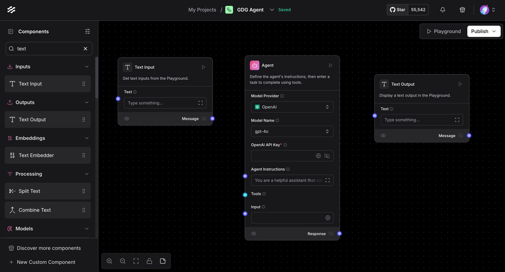
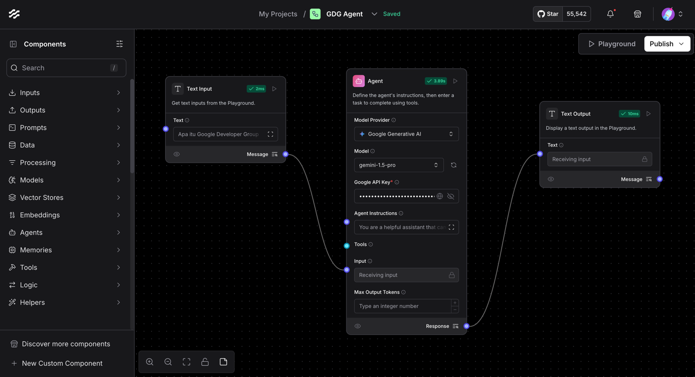
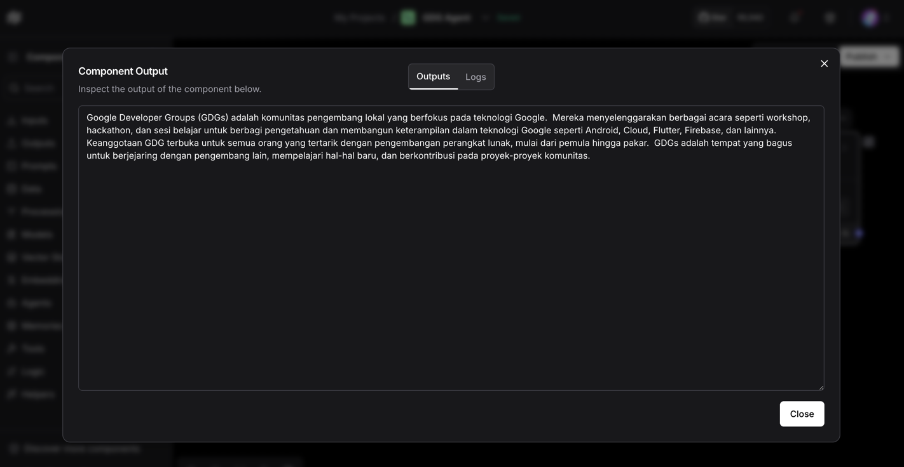
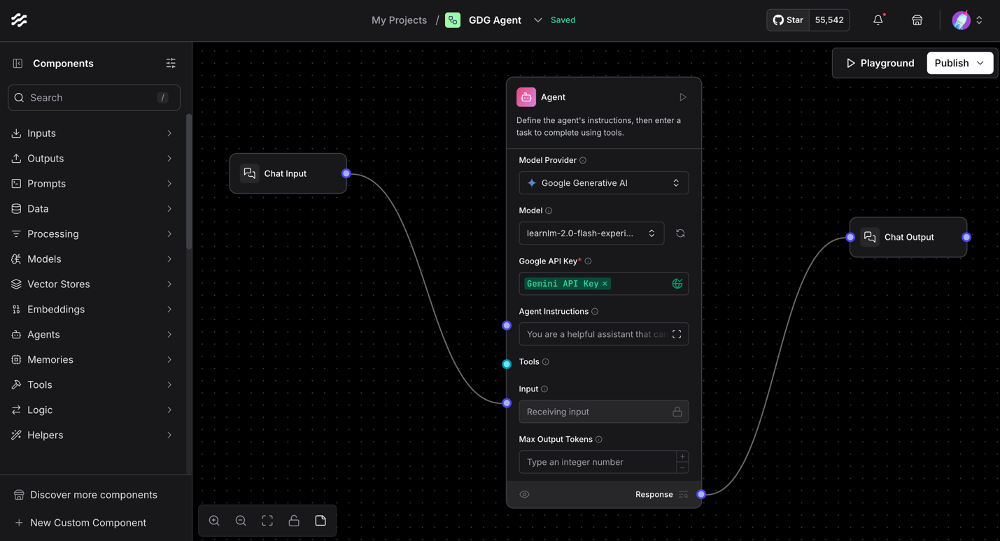

# Quickstart & Simple Flow

Versi videonya bisa kamu lihat / click Youtube di bawah ini :

[](https://www.youtube.com/watch?v=Gl4HgWuFfXE&list=PLnyg3GbBr0YZdCyFGPrOebH_vhFMb9FeE&index=2)


Disini kita mulai dari yang paling dasar, yaitu bikin flow sederhana yang bisa kita pakai buat ngetes Langflow.
Sekalian sedikit berkenalan sama Langflow. Agar nantinya lebih familiar dengan tampilan dan cara kerjanya.

## Prerequisites 
- Pastikan **sudah install / setup Langflow** di local device kamu / sudah register Langflow Cloud Hosted service, 
kalau belum bisa cek kembali [Exercise 0: Install Langflow](./exercise%200/exercise%200%20:%20Install%20Langflow.md)
- **Gemini Developer API Key**: Sudah memiliki Gemini API key yang bisa di akses dari link [Google AI Studio](https://aistudio.google.com/apikey) ini.

### Simple Flow dengan TextInput --> Agent ---> TextOutput
Ok, kita mulai dari yang paling dasar, yaitu bikin flow sederhana sekedar input, agent dan output.

Pastikan sudah membuka Langflow terlebih dahulu.

1. Kita akan membuat flow baru dengan menekan tombol **+ New Flow**.
2. Pilih **+ Blank Flow** dari menu popup yang muncul, disni ada banyak template yg sudah jadi, tapi kali ini kita akan bikin dari awal.
3. Ganti nama flow / workspacenya menjadi dari **Untitled document** menjadi **GDG Agent** contohnya. 
4. Di sebelah kiri di menu **Components** kita pilih **Text Input** dan drag ke workspace yang sudah kita buat.
5. Lalu tambahkan juga **Agent** dan **Text Output** ke workspace yang sama. 
   - Sehingga overviewnya kurang lebih seperti ini : 
6. Di komponen **Agent** ganti : 
   - Model prodivernya ke **Google Generative AI*
   - Isi **Google API Key** dengan API key yang sudah kita dapatkan sebelumnya.
   - Model ke **gemini-1.5-pro**
7. Tarik **message** dari Text Input ke Agent **Input**. 
8. Tarik **response** dari Agent ke Text Output **Text**.
   - Sehingga overviewnya kurang lebih seperti ini : 

9. Ok disini sudah jadi 1 flow sederhana, mari kita coba untuk mulai menjalankan flownya. Di component Text Input di bagian **Text** kita bisa isi dengan text yang kita mau, misalnya 
    ```text
   Apa itu Google Developer Group?
    ```
10. Lalu di component Text Output click **Run Component**, dia yg berbentuk play button, dan kita bisa lihat hasilnya di bagian **Text Output** click 
    icon **Inspect Output** disebelah kanan Message di component Text Output.
11. Maka kita sudah berhasil membuat flow sederhana dengan Langflow, dan kita bisa lihat hasilnya di bagian **Text Output**. 
    - Sehingga overviewnya kurang lebih seperti ini : 


## Sekedar catatan : 
- Setiap komponen di Langflow ini, dibelakangnya adalah code Python, yang bisa kita edit dan custom kita buat component kita sendiri.
Contohnya kalau click component **Text Input** kita bisa lihat di bagian **Code** disebelah kanan, dan kita bisa edit juga disini.
- Hampir semua komponen, kita bisa inspect outputnya, beserta logsnya.
- Setiap komponen, bisa di custom juga controlnya dimana bisa dilihat di bagian **Controls** di komponennya.

### Simple Flow dengan ChatInput --> Agent ---> ChatOutput
Ok, kita lanjutkan lagi yg bagian exercise 1 ini, yaitu kita ganti Text Input dan Outputnya menjadi Chat Input dan Output.

1. Terlebih dahulu, hapus Text Input dan Text Output yang sudah kita buat sebelumnya.
2. Ganti dengan **Chat Input** dan **Chat Output**.
3. Hubungkan komponennya seperti sebelumnya
4. Sama sebelumnya kita hardcode **Google API Key** di Agent, karena ini kurang best practice, jadi kita ganti dengan **Global Variable**.
5. Di komponen Agent, klik icon 🌐, lalu pilih **+ Add New Variable**.
   - Type isi Credential
   - Name isi **Gemini API Key**
   - Value isi **Google API Key** yang sudah kita dapatkan sebelumnya.
   - Apply to fields isi **Google API Key**, agar kedepannya dia auto fill.
   - Save Variable
   - Ganti nilai Google API Key di Agent menjadi **Gemini API Key**.
   - Jangan lupa pastikan Model nya masih **gemini-1.5-pro**.
6. Nilai ini tersimpan di bagian setting di Global varible, yang bisa di lihat dari pojok kanan atas di bagian icon profile --> settings --> Global Variables.
7. Di komponen agent kita ganti terlebih dahulu **Agent Instructions* nya menjadi 
    ```text
   Kamu adalah agen yang membantu user untuk menjawab pertanyaan mereka tentang GDG Medan. Tolong jawab dengan ceria dan santai. Selain info nama event nya bisa info juga dalam bentuk summary.
   ```
    - Jadi kurang lebih overviewnya seperti ini :    

8. Untuk menjalankannya, kita click **> Plaground** di pojok kanan atas, lalu kita bisa isi di bagian **Chat Input** dengan text yang kita mau, misalnya 
    ```text
   Apa itu Google Developer Group?
    ```
   
Kurang lebih hasilnya sama seperti tadi, tapi ini dalam bentuk chat, kalau tadi text biasanya.

## Closing
Gimana sudah berhasil buat flownya? Kalau tidak berhasil nanti bisa import ini ke flow kamu, dan bisa di edit lagi.
[Flow GDG Agent - Exercise 1.json](flow/GDG%20Agent%20-%20Exercise%201.json)
