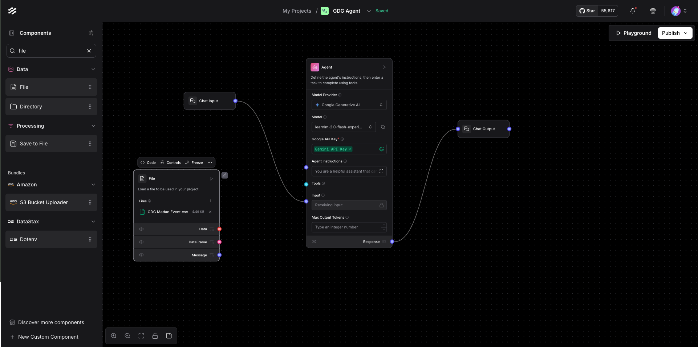
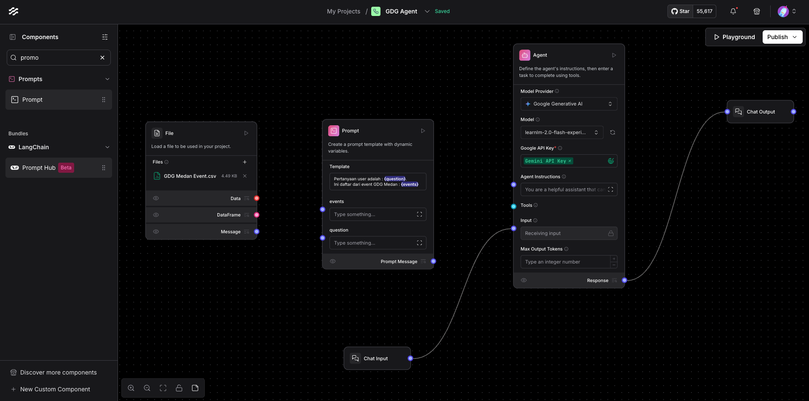
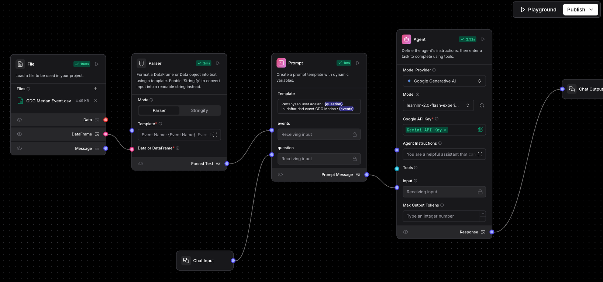

# RAG (Retrieval-Augmented Generation) Basic

Versi videonya bisa kamu lihat / click Youtube di bawah ini :

[](https://www.youtube.com/watch?v=20h8FskowAQ&list=PLnyg3GbBr0YZdCyFGPrOebH_vhFMb9FeE&index=4&t=2s)

Disini kita mulai perkenalan tentang basic RAG (Retrieval-Augmented Generation) dengan Langflow, menggunakan komponen File di Langflow untuk mengupload file yang akan kita gunakan sebagai knowledge base kita.

## Prerequisites 
- Pastikan sudah **menyeleaikan [exersise 1](../exercise%201/exercise%201%20%3A%20Quickstart%20%26%20Simple%20Flow.md)**. 
Kalau belum, bisa import flow yg sudah kita buat di exercise 1 menggunakan file `GDG Agent - Exercise 1` yang ada di disini [GDG Agent - Exercise 1.json](../exercise%201/flow/GDG%20Agent%20-%20Exercise%201.json). 
Cara import flow bisa mengikuti panduan di [Import Flow](https://docs.langflow.org/components-data#file).


## Kenapa RAG?
Flow yg kita buat sebelumnya, ada kelemahannya, yaitu kalau kita tanya kedia pertanyaan ini, kemungkinan besar dia tidak bisa jawab, contohnya : 

```text
Apa saja event GDG Medan di 2025?
```

Maka jawaban dari dia adalah : 
```text
Saya tidak punya informasi tentang event GDG Medan mendatang di tahun 2025. Coba cek situs web atau media sosial mereka untuk informasi lebih lanjut.
```

Ini karena model llm yg kita gunakan cutoff date knowledge / informasi dia tidak sampai 2025. Untuk itu kita perlu menambahkan knowledge base ke dalam flow kita, agar model llm kita bisa menjawab pertanyaan yang lebih spesifik.
Sehingga disini kita akan menggunakan RAG (Retrieval-Augmented Generation) untuk menambahkan knowledge base ke dalam flow kita.

1. Download file knowledge base yang sudah disediakan di `exercise/data` di dalam bentuk CSV [GDG Medan Event.csv](data/GDG%20Medan%20Event.csv)
2. Tambahkan komponent baru, yaitu komponen `File`, untuk mengupload file CSV yang sudah kita download sebelumnya.
3. Dari komponen `File` upload file CSV tadi, lalu select File, sehingga dia kurang lebih seperti ini : .
4. Tambahkan komponet baru, yaitu `Prompt`, ini nanti kita gunakan untuk manage prompt kita, termasuk mengatur prompt untuk RAG kita.
5. Klik `Template` di komponen `Prompt`, lalu isi dengan dengan text di bawah ini dan save : 
    ```text
    Pertanyaan user adalah : {question}. 
    Ini daftar dari event GDG Medan : {events}
    ```
   Setelah itu click **Check & Save**

   Disini {question} dan {events} adalah variable template yg bisa kita gunakan untuk mengisi data dari komponen lain ke dalam prompt kita. Dimana kalau dilihat, dia otomatis muncul sebagai input di promptnya.
   
6. Kalau kita informasi dari CSV tadi terlalu banyak, sementara kita gk butuh semuanya terutama kolom description, dan link sehingga disini kita perlu komponen `Parser`
7. Tambahkan komponen `Parser`, lalu ubah komponennya seperti ini : 
    - **Mode** : parser
    - **Template** isi dengan ini 
      ```text
      Event Name: {Event Name}. Event Date {Date}.
      ```
    - Jadi parser ini hanya memgambil column Event Name dan Date saja dari CSV kita tadi.
8. Hubungkan `DataFrame` dari komponen File ke komponen Parser di bagian `Data or DataFrame`
9. Hubungkan `Parsed Text` dari komponen Parser ke `events` di komponen Prompt
10. Hapus hubungan komponen ChatInput dan agent. Hubungkan komponen ChatInput ke `question` di komponen Prompt
11. Hubungkan `Prompt Message` dari komponen Prompt ke `Input` di komponen Agent. Sehingga kurang lebih overviewnya seperti ini : 
12. Jalankan flow dengan Plaground, dan coba tanya pertanyaan di awal tadi : 
    ```text
    Apa saja event GDG Medan di 2025?
    ```
    
    Maka jawaban dari dia adalah : 
    ```text
    Berikut adalah event GDG Medan di tahun 2025:
    - Google Cloud Roadshows x Build with AI Medan 2025 pada 26 April 2025
    - International Women's Day Medan 2025 pada 19 April 2025
    ```
13. Bisa coba tanya pertanyaan lain juga, contohnya : 
    ```text
    Kalau di 2024, ada berapa event GDG?
    ```

    Maka jawaban dari dia adalah :
    ```text
    Di tahun 2024, ada 7 event GDG Medan berdasarkan daftar yang Anda berikan.
    ```
14. Tapi, ini adalah kelemahannya, yaitu kalau kita tanya informasi ini : 
    ```text
    Tahun ini ada berapa event di GDG Medan?
    ```

    Maka jawaban dari dia adalah :
    ```text
    Berdasarkan informasi yang diberikan, ada 7 event GDG Medan yang diadakan pada tahun 2024:
    - DevFest Medan 2024 (07 Desember 2024)
    - WTM Talks: Road to DevFest Medan 2024 (07 Desember 2024)
    - #JuaraGCP - Cloud AI Study Jam Medan (31 Agustus 2024)
    - Google I/O Extended 2024 Medan (20 Juli 2024)
    - Build with AI Medan 2024 (11 Mei 2024)
    - Impact the Future | International Women's Day (IWD) Medan 2024 (21 April 2024)
    - Web, Artificial Intelligence & Machine Learning in The Future (02 Maret 2024)
    ```
15. Nah disini LLM nya tidak mengerti istilah `tahun ini`, karena cutoff date dia adalah 2024, maka dia anggap tahun ini adalah 2024. Sehingga disini, kita perlu bantu dia agar dia bisa akses tahun saat ini.
16. Disini kita tambahkan komponen baru, yaitu `Current Date` untuk mendapatkan tanggal saat ini. Di Langflow, komponen itu bisa sebagai standalone bisa juga sebagai tools.
    Bedanya apa? Kalau standalone, maka kita perlu jalankan manual, kalau tools dia agak dijalankan sendiri oleh agent. Sehingga nanti agent yg tentukan, kapan tools ini perlu digunakan.
17. Maka klik komponen `Current Date`, lalu ubah komponen ini menjadi tools, dengan mengubah `Tool Mode` menjadi `active`.
    - Selain itu di komponen `Curent Date` klik icon setting di bagian `Edit Tools` nya, lalu ubah `Tool Description` nya menjadi ini 
    ```text
      Bisa digunakan ini untuk pengecekkan waktu saat ini.
      ```
    ini sebagai informasi ke LLM / Agent, kapan dia harus pakai tool ini.
18. Hubungkan `Toolset` dari komponen `Current Date` ke `tools` di komponen Agent. 
19. Ganti `Agent Instruction` di komponen Agent, menjadi seperti ini : 
    ```text
    Kamu adalah agen yang membantu user untuk menjawab pertanyaan mereka tentang GDG Medan. Tolong jawab dengan ceria dan santai. Selain info nama event nya bisa info juga dalam bentuk summary.
    Jika ada pertanyaan mengenai waktu saat ini, jalankan terlebih dahulu tools yg tersedia untuk mengambil waktu saat ini, baru kombinasikan dengan data yg tersedia berdasarkan informasi tersebut.
    ```
20. Coba jalankan kembali flownya dan tanya pertanyaan yg sama.
    ```text
    Tahun ini ada berapa event di GDG Medan?
    ```

    Maka jawaban dari dia adalah :
    ```text
    Hai! Ada 2 event GDG Medan di tahun 2025 ini. Berikut daftarnya:
    - Google Cloud Roadshows x Build with AI Medan 2025, 26 April 2025: Event ini merupakan roadshow Google Cloud yang bekerja sama dengan Build with AI. Akan membahas seputar teknologi terbaru Google Cloud dan penerapan AI.
    - International Women's Day Medan 2025, 19 April 2025: Event ini merayakan hari perempuan internasional dan membahas peran perempuan di bidang teknologi.
    ```

## Sekedar catatan :
- Ketika LLM menggunakan tools, biasanya dia akan info di chat nya menggunakan tool apa saja.
- Kadang LLM tidak menjalankan tools yg kita inginkan, bisa jadi limitasi LLM nya belum begitu support dengan agent, atau bisa juga karena kita full pakai bahasa Indonesia, 
  maka kita perlu mengatur `Agent Instruction` kita agar lebih spesifik begitu juga kita perlu adjust tool description nya.
- Dokumentasi tambahan mengenai komponen langflownya : 
  - [Agents overview](https://docs.langflow.org/agents-overview)
  - [Prompt components in Langflow](https://docs.langflow.org/components-prompts)
  - [File](https://docs.langflow.org/components-data#file)
