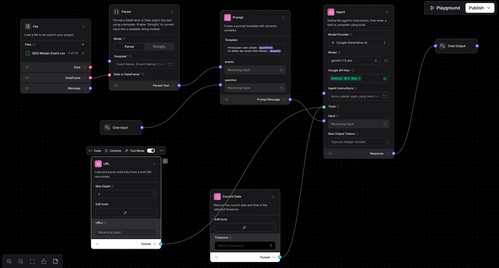

# Url Tool

Disini kita akan mengembangkan flownya untuk bisa akses ke internet / website dengan menggunakan tool `Url / Fetch`.

## Prerequisites
- Pastikan sudah menyelesaikan [exercise 2 : RAG Basic.md](../exercise%202/exercise%202%20%3A%20RAG%20Basic.md)
- Kalau belum, bisa import flow yg sudah kita buat di exercise 2 menggunakan file `GDG Agent - Exercise 2` yang ada di disini [GDG Agent - Exercise 2.json](../exercise%202/flow/GDG%20Agent%20-%20Exercise%202.json).
Cara import flow bisa mengikuti panduan di [Import Flow](https://docs.langflow.org/components-data#file).


## Kenapa Menggunakan Tool Url / Fetch?
Flow yg kita buat sebelumnya, ada kelemahannya, yaitu kalau kita tanya kedia pertanyaan ini, kemungkinan besar dia tidak bisa jawab, contohnya : 

```text
Di event Google Cloud Roadshows x Build with AI Medan 2025, siapa saja speakernya?
```

Maka jawabannya kalau bukan halusinasi / asal jawab, kemungkinan kurang lebih seperti ini : 
```text
Hai! Untuk event Google Cloud Roadshows x Build with AI Medan 2025, speakernya adalah masih dalam tahap perencanaan nih. 
Belum ada informasi lebih lanjut, jadi ditunggu aja ya! Kabar baiknya, acaranya akan diselenggarakan pada 26 April 2025. 
Catat tanggalnya dan nantikan informasi selanjutnya ya! 😉
```

Ini terjadi karena LLM / Agent nya tidak punya informasi mengenai speaker tersebut, karena di CSV sebelumnya juga gak ada informasinya.

Tapi di CSV sebelumnya, ada disana url eventnya, jadi menggunakan tool `Url / Fetch` kita bisa ambil informasi dari website tersebut, dan kita bisa gunakan untuk menjawab pertanyaan diatas.
Dan ini di handle oleh agent / LLM secara otomatis.

1. Pertama, tambahkan komponen `Url` ke dalam flow
    - Url komponent bisa digunakan sebagai komponen standalone
    - Di dalam komponen ini terdapat beberapa tools yang nantinya bisa digunakan oleh LLM / Agent
2. Ubah komponen `Url` menjadi tool mode. Dengan cara klik `Tool Mode` menjadi `Aktif` dibagian atas komponennya.
3. Hubungkan `Toolset` komponen Url ke `Tools` di komponen Agent, sehingga kurang lebih overviewnya seperti ini : 
4. Ubah `Template` di komponen Parser, menjadi seperti ini : 
    ```text
    Event Name: {Event Name}. Event Date {Date}. Link: {Link}.
    ```
5. Ubah `Agent Instruction` di komponen Agent menjadi seperti ini : 
    ```text
    Kamu adalah agen yang membantu user untuk menjawab pertanyaan mereka tentang GDG Medan. Tolong jawab dengan ceria dan santai. Selain info nama event nya bisa info juga dalam bentuk summary.

    Jika ada pertanyaan mengenai waktu saat ini, jalankan terlebih dahulu tools yg tersedia untuk mengambil waktu saat ini, baru kombinasikan dengan data yg tersedia berdasarkan informasi tersebut.

    Kalau ada informasi yg kamu tidak ketemu, coba kamu cari terlebih dahulu informasi dari website / url event tersebut menggunakan tools dan url yg tersedia.
    ```
6. Karena sekarang kita memiliki beberapa tools, kadang kala beberapa llm belum begitu support dengan agent yg banyak / complex. Sehingga disini, modelnya kita perlu ganti / update menjadi 
   `gemini-2.5-pro-preview` atau `gemini-2.0-pro-exp`. Tapi kalau ada model terbaru dari itu, bisa pakai itu juga.
7. Kita coba run dan tanya pertanyaan diatas lagi : 
    ```text
    Di event Google Cloud Roadshows x Build with AI Medan 2025, siapa saja speakernya?
    ```

    Maka jawabannya kurang lebih seperti ini : 
    ```text
    Oke siap! Aku cek dulu yaa info speakernya dari link event Google Cloud Roadshows x Build with AI Medan 2025.
    cek info dari link... 🧐

    Aha! Ketemu nih daftar speakernya. Ini dia orang-orang keren yang bakal jadi pembicara di event Google Cloud Roadshows x Build with AI Medan 2025 tanggal 26 April 2025 nanti:
    - Muhammad Saipul Rohman - Data Engineer @ Global Professional Services Company | GDE Cloud - Data
    - Ade Maulana - Lecturer @ Universitas Pelita Harapan
    - Ifan Jaya Suswanto Zalukhu - Head of Engineering @ SimpliDOTS
    ```
   Dimana kalau dilihat disini, llm / agentnya otomatis menjalankan tools url / fetch nya untuk mengakses website informasi dari speakernya.

## Sekedar catatan :
- Disini kita menggunakan model yg experimental, jadi mungkin ada beberapa hal yg tidak sesuai harapan. Dan kalau di production mungkin 
