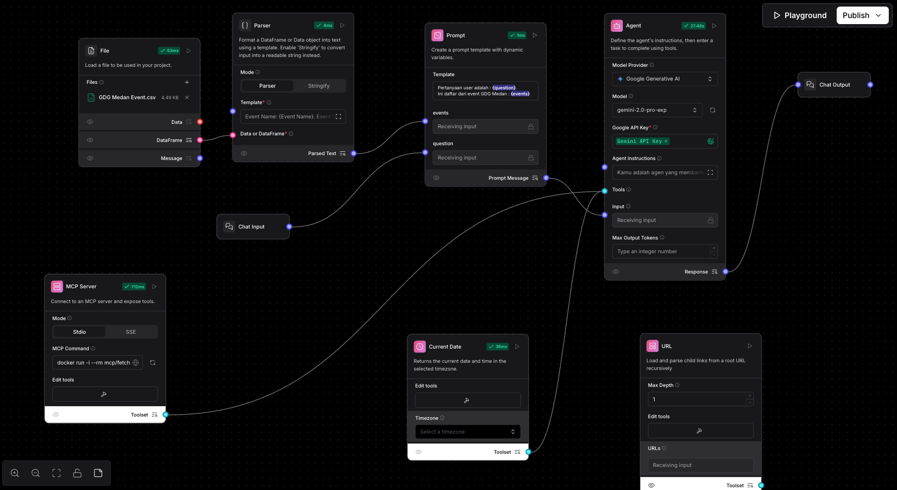

# MCP Basic

Versi videonya bisa kamu lihat / click Youtube di bawah ini :

[](https://www.youtube.com/watch?v=LaCn7siOeYA&list=PLnyg3GbBr0YZdCyFGPrOebH_vhFMb9FeE&index=6)


Ok, disini kita akan belajar cara menggunakan `MCP` ([Model Context Protocol](https://www.anthropic.com/news/model-context-protocol)) di Langflow. 

Model Context Protocol (MCP) adalah standar terbuka buatan Anthropic yang bikin model AI bisa terhubung dengan berbagai data dan tools eksternal dengan lebih gampang. Ibaratnya kayak port USB-C buat AI—satu colokan yang bisa nyambung ke mana-mana tanpa perlu adapter ribet.

Langflow sendiri dalam hal MCP dia bisa sebagai `client` dan `server`. Di exercise ini kita akan belajar cara menggunakan MPC Server Fetch. Untuk beberapa list MCP server sendiri bisa dilihat [di link ini ](https://github.com/modelcontextprotocol/servers)

Disini saya tidak begitu dalam membahas MCP, tapi kalau tertarik lebih dalam mempelajarinya bisa baca artikel [MCP: What It Is and Why It Matters](https://addyo.substack.com/p/mcp-what-it-is-and-why-it-matters) ini ya, disana dijelaskan secara detail 
mengenai MCP serta contoh-contoh penggunaannya di setiap bidang.

## Prerequisites
- Pastikan sudah menyelesaikan [exercise 3 : Url Tool.md](../exercise%203/exercise%203%20%3A%20Url%20Tool.md)
- Kalau belum, bisa import flow yg sudah kita buat di exercise 2 menggunakan file `GDG Agent - Exercise 3` yang ada di disini [GDG Agent - Exercise 3.json](../exercise%203/flow/GDG%20Agent%20-%20Exercise%203.json).
  Cara import flow bisa mengikuti panduan di [Import Flow](https://docs.langflow.org/components-data#file).
- Docker sudah terinstall dan berjalan di device kamu.


## Kenapa MCP?
Karena kalau baca artikel referensi di atas, MCP memiliki potensi besar untuk menjadi pendekatan *MCP First Development*, 
yaitu kita membangun MCP server untuk aplikasi kita sebelum atau bersamaan dengan pembuatan GUI. 
Dengan cara ini, kita memastikan sejak awal bahwa AI dapat menggerakkan aplikasi kita. 
Hal ini juga menunjukkan masa depan di mana AI menjadi pengguna utama perangkat lunak, bukan hanya sebagai tambahan belakangan.

Di exercise kali ini kita menggunakan MCP server yang sudah ada, yaitu [Fetch MCP Server](https://github.com/modelcontextprotocol/servers/tree/main/src/fetch),
dimana yg fungsinya kurang lebih seperti komponen `Url` di Langflow, yaitu untuk mengambil data dari URL yang kita inginkan, tapi ini yg versi MCP.


## Install Fetch MCP Server
Untuk install Fetch MCP server, kita bisa menggunakan `docker`, `uvx`, `python`, dll.
Tapi disini kita akan menggunakan `docker` saja, karena lebih mudah dan cepat.

1. Pastikan `docker` sudah terinstall di sistem kamu, dan sudah berjalan.
2. Di workspace Langflow, kita tambahkan komponen baru yaitu `MCP Server`
    - Modenya set ke `Stdio`
    - MCP Commandnya isi dengan 
    ```bash
    docker run -i --rm mcp/fetch
    ```
   - Click refresh button di sebelah kanan MCP commandnya
   - Kalau berhasil, akan muncul tool baru di tool di komponen MCP Servernya
   - Dibelakang layar juga tercreate container docker baru
3. Kita ubah komponen MCP servernya dari standalone menjadi Tool Mode
4. Disini kita akan gantikan komponen `Url` yang ada di flow kita dengan komponen `MCP Server` yang sudah kita buat
5. Jadi hapus koneksi antara komponen `Url` dan `Agent`, lalu sambungkan komponen `MCP Server` ke `Agent`. Sehingga kurang lebih overviewnya seperti ini : 
6. Kita jalankan playgroundnya, dan coba tanya pertanyaan yang sama seperti diatas
```text
    Di event Google Cloud Roadshows x Build with AI Medan 2025, siapa saja speakernya?
```

Dan jawabannya tidak jauh beda dari yg sebelumnya yaitu : 
```text
    Halo! Asiiik, kamu nanyain soal event Google Cloud Roadshows x Build with AI Medan 2025 ya? Aku cek langsung nih dari link eventnya. 😉
    Ini dia daftar speaker keren yang bakal hadir:
    - Muhammad Saipul Rohman (Data Engineer @ Global Professional Services Company | GDE Cloud - Data)
    - Ade Maulana (Lecturer @ Universitas Pelita Harapan)
    - Ifan Jaya Suswanto Zalukhu (Head of Engineering @ SimpliDOTS)
```


