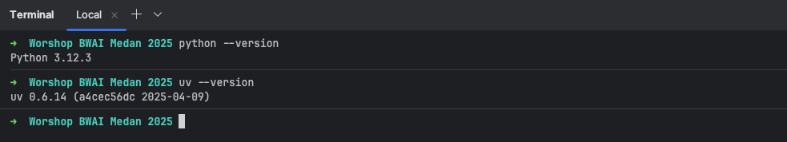

# Workshop Build with AI Medan 2025

Proyek ini adalah repository untuk latihan workshop **Build Your First AI Agent with Langflow + Google Generative AI** yang diadakan di event [Google Cloud Roadshow x Build with AI Medan 2025](https://gdg.community.dev/events/details/google-gdg-medan-presents-google-cloud-roadshows-x-build-with-ai-medan-2025/).

Di workshop ini, kita akan belajar bareng cara bikin AI agent pertama kamu menggunakan Langflow, sebuah low-code tools yang memudahkan kamu mendesain AI agent secara visual tanpa perlu coding yang rumit. Kita juga akan mengintegrasikan Langflow dengan Google Generative AI models seperti Gemini dari Vertex AI untuk membangun aplikasi AI interaktif dari awal.

Setelah sesi ini, harapannya kamu bisa:
- Memahami bagaimana Langflow menyederhanakan pengembangan AI agent dengan drag-and-drop interface.
- Belajar cara menghubungkan Langflow dengan Google Generative AI models melalui Vertex AI.
- Membangun AI agent yang berfungsi melalui demo langsung step-by-step.

Event ini adalah bagian dari Google Cloud Roadshows x Build with AI, salah satu event pembelajaran terbesar yang digerakkan oleh komunitas dan diselenggarakan oleh Google Developer Groups (GDG) Medan. Event ini dirancang untuk memberdayakan developer, pelajar, dan profesional teknologi dengan mengeksplorasi kemampuan Google Cloud Platform (GCP) dan Artificial Intelligence (AI).


---

## Prerequisites
Sebelum mengikuti workshop ini, pastikan kamu sudah menyiapkan hal-hal berikut:
- **[Python 3.10 to 3.13](https://www.python.org/downloads/release/python-3120/)**: Pastikan Python sudah terinstall di sistem kamu, dan versinya ada di range ini (tidak boleh di bawah 3.10 atau di atas 3.13). Kamu bisa download dan install Python lewat link ini (https://www.python.org/downloads/release/python-3123/), pilih sesuai OS yang kamu pakai.
- **[uv](https://docs.astral.sh/uv/getting-started/installation/) dan [pip](https://pypi.org/project/pip/)**: Disarankan untuk menggunakan `uv` karena lebih cepat dan modern. Di workshop ini, kita akan banyak menggunakan `uv`, tetapi jika kamu lebih nyaman dengan `pip`, itu juga tidak masalah karena fungsinya tidak jauh berbeda. Kalau pakai uv tetap perlu install pip juga. Untuk install `uv`, ikuti panduan di sini (https://docs.astral.sh/uv/getting-started/installation/), sesuaikan dengan OS kamu. 
- **Gemini Developer API Key**: Kamu bisa dapetin keynya dari link [Google AI Studio](https://aistudio.google.com/apikey) ini.

Buat ngecek apakah semua prerequisites sudah terinstall dengan benar, kamu bisa coba jalanin perintah ini di terminal:
```bash
  python --version
  pip --version
  uv --version
```
Kalau sudah terinstall, kamu bakal lihat versi Python dan uv/pip yang ada di sistem kamu. Pastikan versinya sesuai dengan yang disarankan di atas.



---


## Getting Started
Ada beberapa cara buat mulai pakai Langflow, nih pilihannya:

- **[Langflow Desktop](https://docs.langflow.org/get-started-installation#install-and-run-langflow-desktop)**: Ini versi desktop, tapi masih Alpha, jadi belum stabil. Selain itu, cuma support di macOS, jadi kita skip dulu yang ini.
- **[Langflow Web / Cloud Hosted Service](https://docs.langflow.org/get-started-installation#datastax-langflow)**: Versi ini hosted di cloud lewat DataStax Langflow. Kamu perlu register dan login dulu di [DataStax Langflow](https://astra.datastax.com/signup?type=langflow).
- **[Langflow.new](https://langflow.new/ui)**: Cara paling cepat dan simpel. Tinggal buka link ini, langsung bisa pakai tanpa perlu register atau login. Tapi, semua flow yang kamu buat bakal public.
- **[Local / Python package](https://docs.langflow.org/get-started-installation#install-and-run-langflow-oss)**: Install langsung di local device kamu. Ini yang paling fleksibel, apalagi kalau mau coba integrasi sama LLM lokal kayak Olama.

Aku pribadi lebih sering pakai yang local karena lebih bebas dan gampang buat eksperimen. Tapi kalau device kamu nggak support atau ada kendala install, nggak masalah pakai versi Cloud Hosted Service aja. Tinggal register dan login, beres.

Kalau mau install Langflow di local, ikutin langkah-langkah di exercise ini:
* [Exercise 1 : Install Langflow.md](exercises/exercise%201%20%3A%20Install%20Langflow.md)

---

## Questions / Issues
Kalau ada pertanyaan atau masalah, feel free untuk submit atau open `issue` di repo ini. Kamu juga bisa langsung email aku di `ivan.zalukhu97@gmail.com`.


## License
Repo ini free dan public, jadi feel free untuk digunakan atau di-clone/fork kalau perlu.

## Contribution
Kalau kamu tertarik kontribusi seperti fixing kendala, typo, atau mau nambahin use case baru, silakan fork repo ini dan buat pull request-nya. Kalau repo ini dirasa bermanfaat dan membantu, boleh banget di-star GitHub repo-nya biar makin banyak yang tahu dan bisa belajar bareng. 😊
